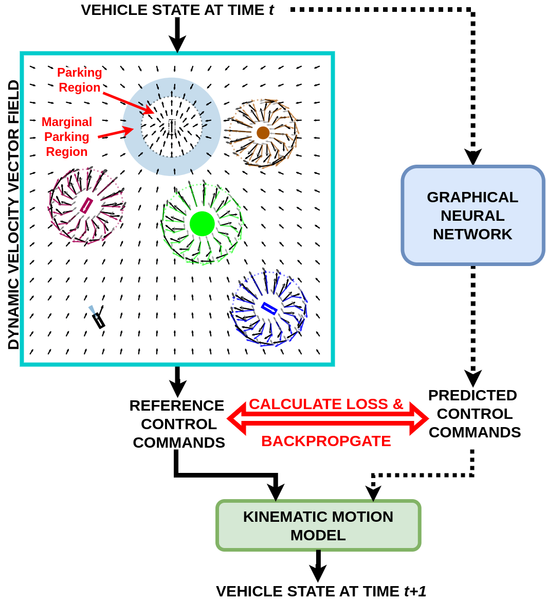
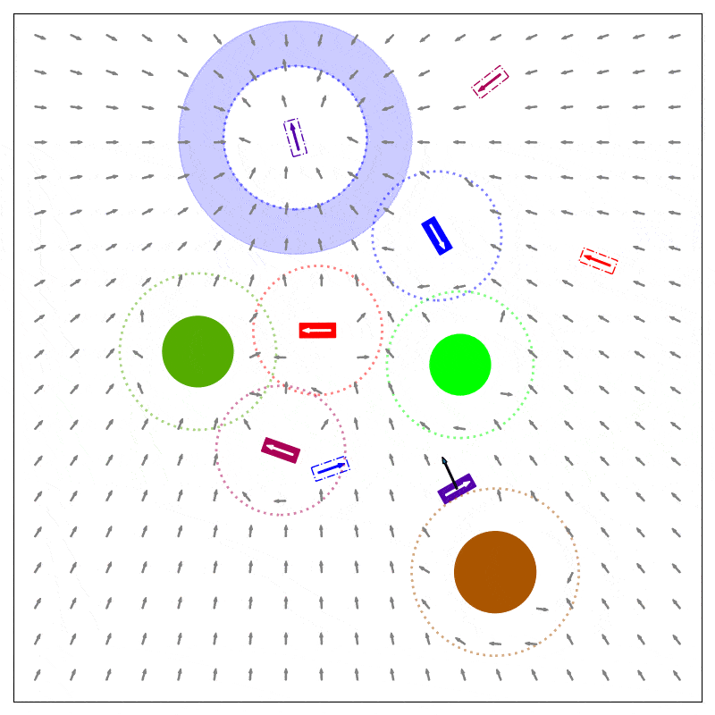
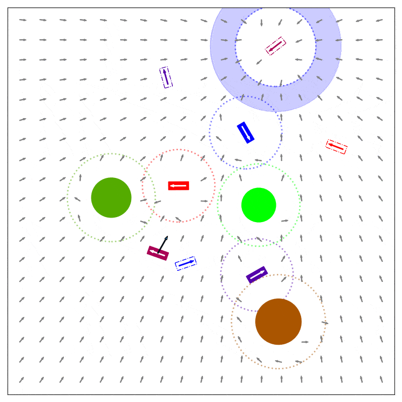
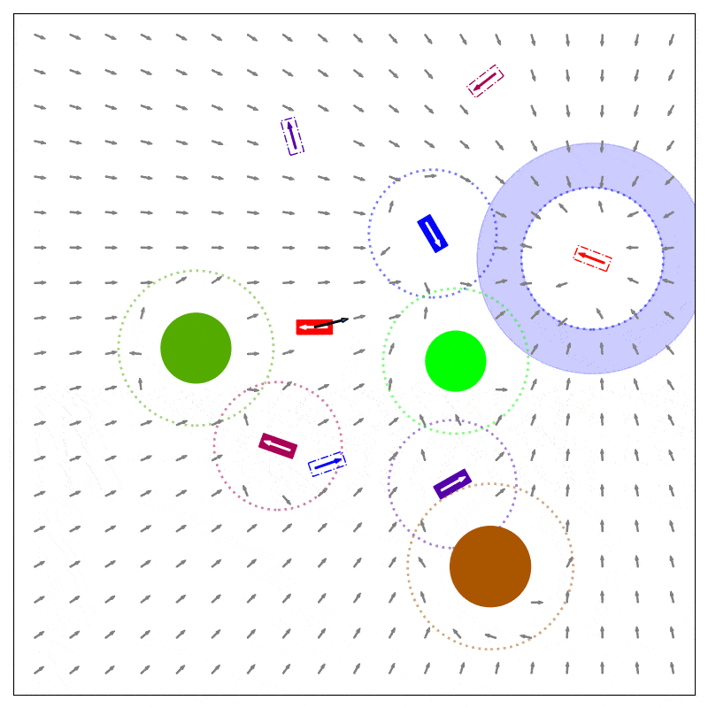

# MA-DV2F: A Multi-Agent Navigation Framework using Dynamic Velocity Vector Field

**Yining Ma, Qadeer Khan and Daniel Cremers – IEEE RAL 2025**


[Project](https://yininghase.github.io/MA-DV2F/) | [ArXiv](http://arxiv.org/abs/2411.06404)


This repository contains the code for the paper **MA-DV2F: A Multi-Agent Navigation Framework using Dynamic Velocity Vector Field**. 

In this paper we propose MA-DV2F: Multi-Agent Dynamic Velocity Vector Field. It is a framework for simultaneously controlling a group of vehicles in challenging environments. DV2F is generated for each vehicle independently and provides a map of reference orientation and speed that a vehicle must attain at any point on the navigation grid such that it safely reaches its target. The field is dynamically updated depending on the speed and proximity of the ego-vehicle to other agents. This dynamic adaptation of the velocity vector field allows prevention of imminent collisions. Experimental results show that MA-DV2F outperforms concurrent methods in terms of safety, computational efficiency and accuracy in reaching the target when scaling to a large number of vehicles.




## Visualization of Dynamic Velocity Vector Field 

<table style="table-layout: fixed; word-break: break-all; word-wrap: break-word;" width="100%">
  <tr>
    <td width="50%">
      <text>
        Velocity Vector Field of the Blue Vehicle
      </text>
    </td>
    <td width="50%">
      <text>
        Velocity Vector Field of the Purple Vehicle
      </text>
    </td>
  </tr>
  <tr>
    <td width="50%">
      
    </td>
    <td width="50%">
      
    </td>
  </tr>
  <tr>
    <td width="50%">
      <text>
        Velocity Vector Field of the Pink Vehicle
      </text>
    </td>
    <td width="50%">
      <text>
        Velocity Vector Field of the Red Vehicle
      </text>
    </td>
  </tr>
  <tr>
    <td width="50%">
      
    </td>
    <td width="50%">
      
    </td>
  </tr>
</table>


## Environment

Clone the repo and build the conda environment:
```
conda create -n <env_name> python=3.7 
conda activate <env_name>
pip install torch==1.11.0+cu113 torchvision==0.12.0+cu113 torchaudio==0.11.0+cu113 -f https://download.pytorch.org/whl/torch_stable.html
pip install --no-index torch-scatter --no-cache-dir -f https://pytorch-geometric.com/whl/torch-1.11.0+cu113.html
pip install scipy
pip install --no-index torch-sparse --no-cache-dir -f https://pytorch-geometric.com/whl/torch-1.11.0+cu113.html
pip install --no-index torch-cluster --no-cache-dir -f https://pytorch-geometric.com/whl/torch-1.11.0+cu113.html
pip install --no-index torch-spline-conv --no-cache-dir -f https://pytorch-geometric.com/whl/torch-1.11.0+cu113.html
pip install torch-geometric==2.0.4
pip install pyyaml
pip install matplotlib
```


## Data Structure

Please organize the data structure as follows:
```
root
|
data
|-- train_dataset
|   |-- collision_mode
|   |   |-- train_data_vehicle={i}_obstacle={j}.pt
|   |   |-- ...
|   |-- normal_mode
|   |-- parking_mode
|   |-- ...
|-- test_dataset
|-- |-- test_data_vehicle={i}_obstalce={j}.pt
|-- |-- ...
!-- prediction
|-- |-- {MODEL/ALGORITHM_NAME_1}
|   |   |-- batches_data_vehicle={i}_obstalce={j}.pt
|   |   |-- X_data_vehicle={i}_obstalce={j}.pt
|   |   |-- y_model_data_vehicle={i}_obstalce={j}.pt
|   |   |-- trajectory_data_vehicle={i}_obstalce={j}.pt
|-- |-- {MODEL/ALGORITHM_NAME_2}
|-- |-- ...

```


## Pipeline
### Data Generation

Modify the [config of data generation](./configs/generate_data.yaml) under your demand. Set the "is test data" [here](./configs/generate_data.yaml#L5) to "True" for test data generation or "False" for train data generation.

Run the generate_data.py to generate train or test dataset:
```
conda activate <env_name>
cd <path_to_this_repo>
python generate_data.py
```

We also provide the dataset generated by us. You can download train dataset [here](https://cvg.cit.tum.de/webshare/g/papers/khamuham/ma-dv2f/train.zip) and test dataset [here](https://cvg.cit.tum.de/webshare/g/papers/khamuham/ma-dv2f/test.zip).

### DVF Inference
Modify the [config of inference](./configs/inference.yaml) under your demand. Set the "algorithm type" [here](./configs/inference.yaml#L5) to "dvf" for dynamic velocity field inference.

Run the inference.py:
```
conda activate <env_name>
cd <path_to_this_repo>
python inference.py
```

### GNN Model Self-Supervised Training

Modify the [config of model training](./configs/train.yaml) under your demand.

Run the train.py:
```
conda activate <env_name>
cd <path_to_this_repo>
python train.py
```

### GNN Model Inference

Modify the [config of inference](./configs/inference.yaml) under your demand. Set the "algorithm type" [here](./configs/inference.yaml#L5) to "gnn" for GNN model inference.

Run the inference.py:
```
conda activate <env_name>
cd <path_to_this_repo>
python inference.py
```

### Result Evaluation

Modify the [config of result evaluation](./configs/calculate_metrics.yaml) under your demand.

Run the calculate_metrics.py:
```
conda activate <env_name>
cd <path_to_this_repo>
python calculate_metrics.py
```

### Result Visualization

Modify the [config of trajectory visualization](./configs/visualize_trajectory.yaml) under your demand. You can specify the indices of selected trajectories for visualization [here](./configs/visualize_trajectory.yaml#L20) or leave it empty for random seletion of trajectories.

Run the visualize_trajectory.py:
```
conda activate <env_name>
cd <path_to_this_repo>
python useful_tools/visualize_trajectory.py
```


## BibTeX
```
@ARTICLE{10960653,
  author={Ma, Yining and Khan, Qadeer and Cremers, Daniel},
  journal={IEEE Robotics and Automation Letters}, 
  title={MA-DV$^{2}$F: A Multi-Agent Navigation Framework Using Dynamic Velocity Vector Field}, 
  year={2025},
  volume={10},
  number={6},
  pages={5823-5830},
  keywords={Vectors;Navigation;Vehicle dynamics;Training;Kinematics;Mathematical models;Force;Estimation;Trajectory;Neural networks;Path planning for multiple mobile robots or agents;autonomous vehicle navigation;autonomous agents},
  doi={10.1109/LRA.2025.3559830}}
```