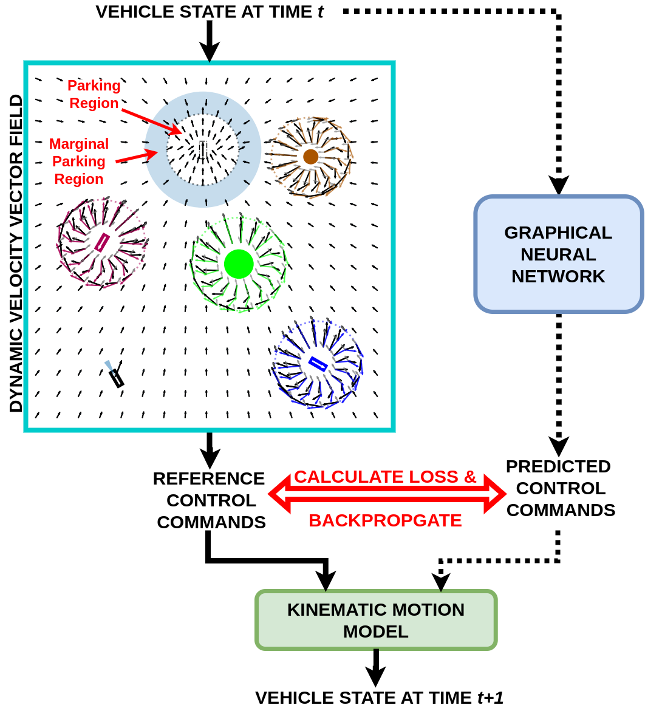
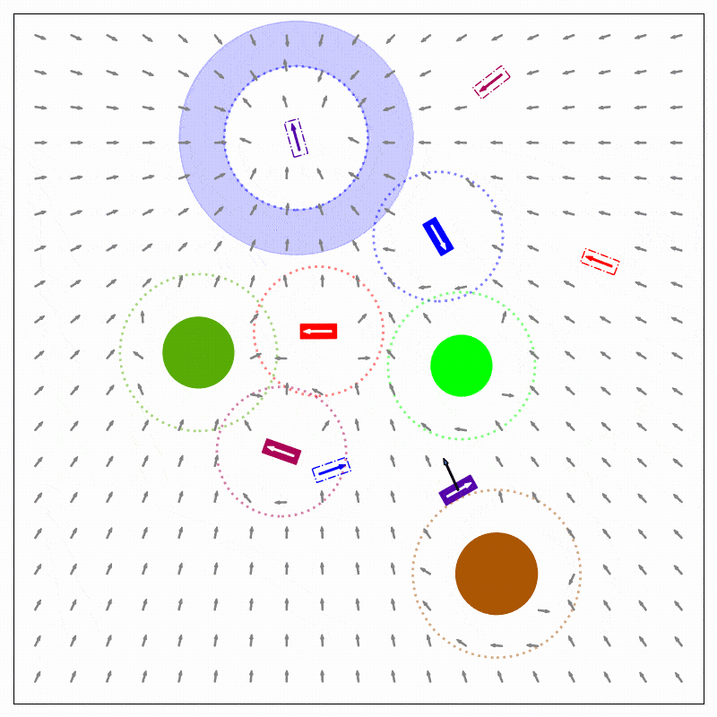
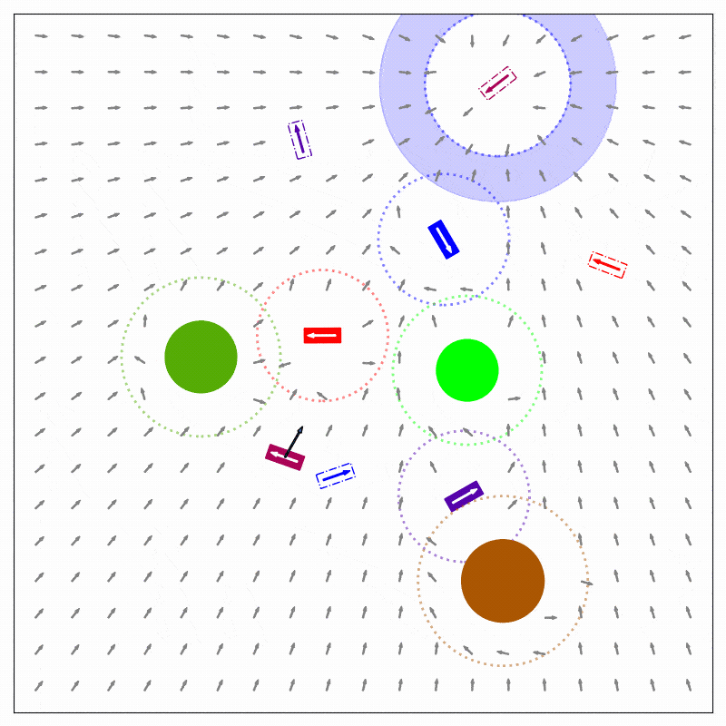
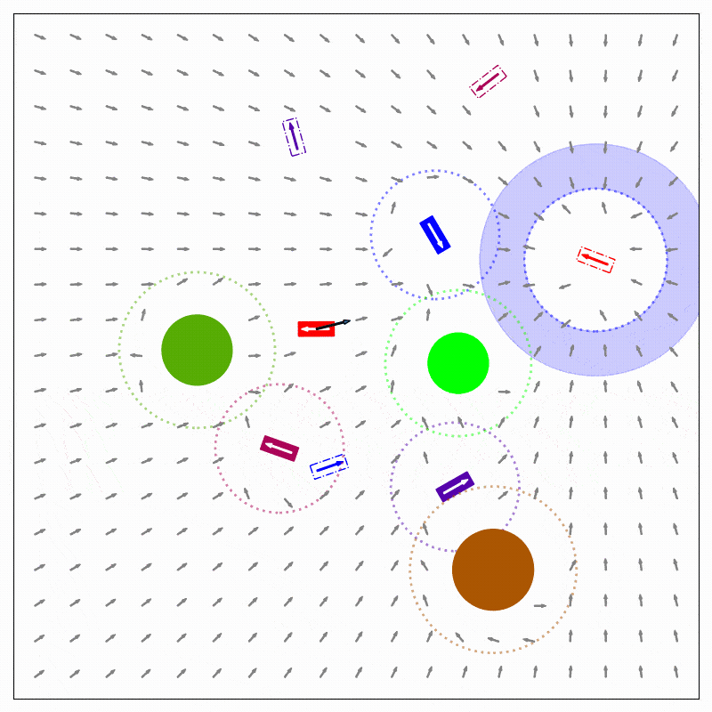

# MA-DV2F: A Multi-Agent Navigation Framework using Dynamic Velocity Vector Field

**Yining Ma, Qadeer Khan and Daniel Cremers**


[Project](https://yininghase.github.io/MA-DV2F/) | [ArXiv]()


This repository contains the code for the paper **MA-DV2F: A Multi-Agent Navigation Framework using Dynamic Velocity Vector Field**. 

In this paper we propose MA-DV2F: Multi-Agent Dynamic Velocity Vector Field. It is a framework for simultaneously controlling a group of vehicles in challenging environments. DV2F is generated for each vehicle independently and provides a map of reference orientation and speed that a vehicle must attain at any point on the navigation grid such that it safely reaches its target. The field is dynamically updated depending on the speed and proximity of the ego-vehicle to other agents. This dynamic adaptation of the velocity vector field allows prevention of imminent collisions. Experimental results show that MA-DV2F outperforms concurrent methods in terms of safety, computational efficiency and accuracy in reaching the target when scaling to a large number of vehicles.

<div align="center"> </div>

## Visualization of Dynamic Velocity Vector Field 

<table style="table-layout: fixed; word-break: break-all; word-wrap: break-word;" width="100%">
  <tr>
    <td width="50%">
      <text>
        Velocity Vector Field of the Blue Vehicle
      </text>
    </td>
    <td width="50%">
      <text>
        Velocity Vector Field of the Purple Vehicle
      </text>
    </td>
  </tr>
  <tr>
    <td width="50%">
      
    </td>
    <td width="50%">
      
    </td>
  </tr>
  <tr>
    <td width="50%">
      <text>
        Velocity Vector Field of the Pink Vehicle
      </text>
    </td>
    <td width="50%">
      <text>
        Velocity Vector Field of the Red Vehicle
      </text>
    </td>
  </tr>
  <tr>
    <td width="50%">
      
    </td>
    <td width="50%">
      
    </td>
  </tr>
</table>


## Environment

Clone the repo and build the conda environment:
```
conda create -n <env_name> python=3.7 
conda activate <env_name>
pip install torch==1.11.0+cu113 torchvision==0.12.0+cu113 torchaudio==0.11.0+cu113 -f https://download.pytorch.org/whl/torch_stable.html
pip install --no-index torch-scatter --no-cache-dir -f https://pytorch-geometric.com/whl/torch-1.11.0+cu113.html
pip install scipy
pip install --no-index torch-sparse --no-cache-dir -f https://pytorch-geometric.com/whl/torch-1.11.0+cu113.html
pip install --no-index torch-cluster --no-cache-dir -f https://pytorch-geometric.com/whl/torch-1.11.0+cu113.html
pip install --no-index torch-spline-conv --no-cache-dir -f https://pytorch-geometric.com/whl/torch-1.11.0+cu113.html
pip install torch-geometric==2.0.4
pip install pyyaml
pip install matplotlib
```

**Code will be released upon acceptance of the paper** 