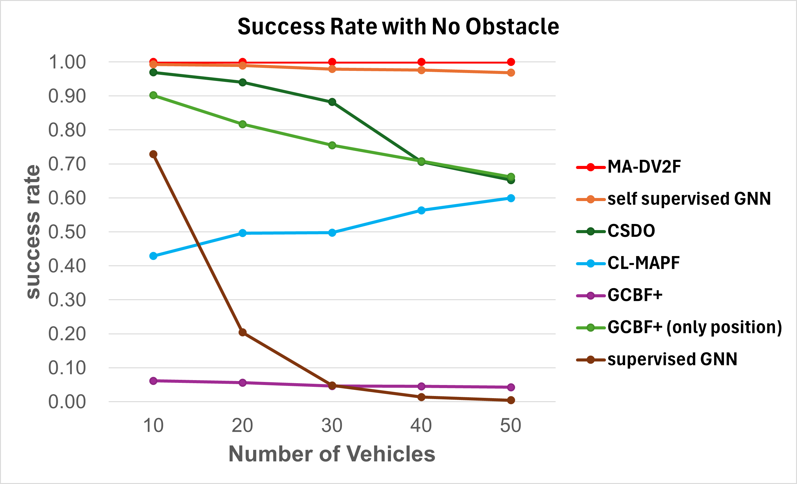
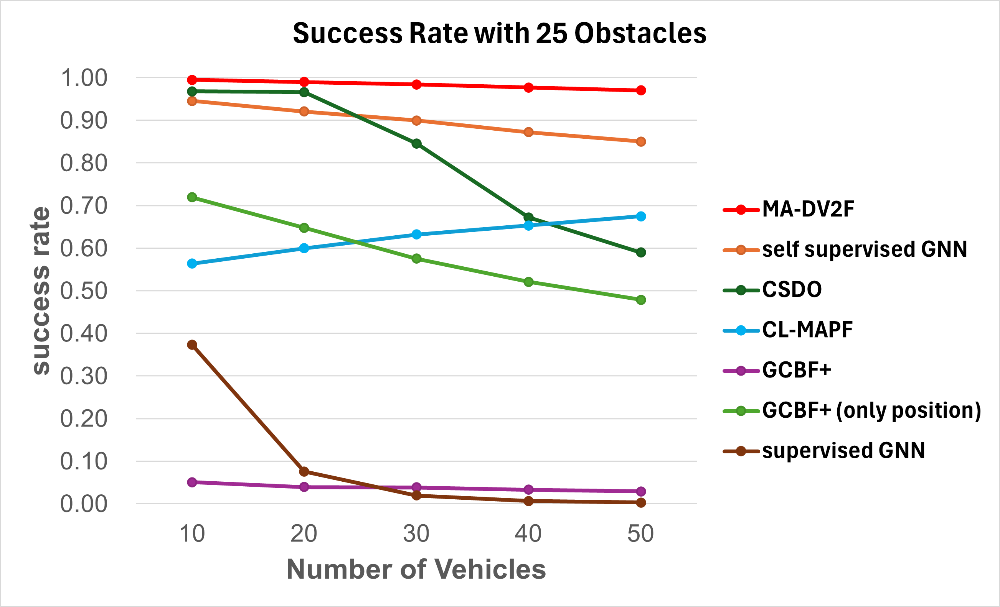

# MA-DV2F: A Multi-Agent Navigation Framework using Dynamic Velocity Vector Field

[](https://ieeexplore.ieee.org/document/10960653)
[](http://arxiv.org/abs/2411.06404)
[](https://yininghase.github.io/MA-DV2F/)

**Yining Ma, Qadeer Khan and Daniel Cremers – IEEE RAL 2025**

[Project](https://yininghase.github.io/MA-DV2F/) | [ArXiv](http://arxiv.org/abs/2411.06404) | [IEEE Xplore](https://ieeexplore.ieee.org/document/10960653)

This repository contains the code for the paper **MA-DV2F: A Multi-Agent Navigation Framework using Dynamic Velocity Vector Field**.

In this paper we propose MA-DV2F: Multi-Agent Dynamic Velocity Vector Field. It is a framework for simultaneously controlling a group of vehicles in challenging environments. DV2F is generated for each vehicle independently and provides a map of reference orientation and speed that a vehicle must attain at any point on the navigation grid such that it safely reaches its target. The field is dynamically updated depending on the speed and proximity of the ego-vehicle to other agents. This dynamic adaptation of the velocity vector field allows prevention of imminent collisions. Experimental results show that MA-DV2F outperforms concurrent methods in terms of safety, computational efficiency and accuracy in reaching the target when scaling to a large number of vehicles.


## Key Results

MA-DV2F scales to **up to 50 vehicles and 25 obstacles** and achieves:

- **High success rate** in reaching target destinations.
- **Low collision rate** thanks to dynamic velocity-field adaptation.
- **Real-time inference** via a lightweight self-supervised GNN that approximates the analytical DVF.

Representative comparisons with baselines are available in `images/model_comparison/`:

<p align="center">
  
  
</p>

Differential and intermediate success rates for each scenario are provided in `images/success_rate/`.

## Visualization of Dynamic Velocity Vector Field

<table style="table-layout: fixed; word-break: break-all; word-wrap: break-word;" width="100%">
  <tr>
    <td width="50%" align="center">Velocity Vector Field of the Blue Vehicle</td>
    <td width="50%" align="center">Velocity Vector Field of the Purple Vehicle</td>
  </tr>
  <tr>
    <td width="50%"></td>
    <td width="50%"></td>
  </tr>
  <tr>
    <td width="50%" align="center">Velocity Vector Field of the Pink Vehicle</td>
    <td width="50%" align="center">Velocity Vector Field of the Red Vehicle</td>
  </tr>
  <tr>
    <td width="50%"></td>
    <td width="50%"></td>
  </tr>
</table>

## Quickstart

With the environment installed and the pre-trained model in place, you can run a full DVF/GNN inference, evaluation, and visualization pipeline in a few commands:

```bash
conda activate <env_name>
cd <path_to_this_repo>

# Run inference (set algorithm type to "dvf" or "gnn" in configs/inference.yaml)
python inference.py --config_path ./configs/inference.yaml

# Calculate metrics
python calculate_metrics.py --config_path ./configs/calculate_metrics.yaml

# Visualize trajectories
python useful_tools/visualize_trajectory.py --config_path ./configs/visualize_trajectory.yaml
```

## Repository Structure

```
MA-DV2F/
├── configs/                    # YAML configuration files for every stage
│   ├── train.yaml
│   ├── inference.yaml
│   ├── inference_gpu.yaml
│   ├── inference_cpu.yaml
│   ├── generate_data.yaml
│   ├── calculate_metrics.yaml
│   ├── visualize_trajectory.yaml
│   └── visualize_velocity_field.yaml
├── models/                     # Pre-trained GNN checkpoint
│   └── self_supervised_model.pth
├── images/                     # Figures, GIFs, and result plots
│   ├── pipeline_overview.png
│   ├── velocity_field/
│   ├── model_comparison/
│   ├── success_rate/
│   └── ...
├── old_implementations/        # MPC baseline and older CPU/GPU scripts
│   ├── simulation.py
│   ├── inference_gpu.py
│   ├── inference_cpu.py
│   ├── dvf_cpu.py
│   └── mpc.py
├── useful_tools/               # Visualization and data-conversion utilities
│   ├── visualize_trajectory.py
│   ├── visualize_velocity_field.py
│   ├── results_yaml_to_torch.py
│   └── test_data_torch_to_yaml.py
├── train.py                    # Self-supervised GNN training
├── inference.py                # DVF / GNN batched inference
├── generate_data.py            # Synthetic train/test data generation
├── calculate_metrics.py        # Evaluation metrics
├── data_process.py             # Data loading and problem generation
├── gnn.py                      # GNN model and DVF reference
├── loss.py                     # Self-supervised loss functions
├── u_attention_conv.py         # Custom TransformerConv layer
├── visualization.py            # Plotting and animation helpers
├── supplementary.pdf           # Paper supplementary material
└── README.md                   # This file
```

## Environment

A CUDA-capable GPU is recommended for training and large-scale inference. A CPU fallback is available via `configs/inference_cpu.yaml`.

Clone the repo and build the conda environment:

```bash
conda create -n <env_name> python=3.7
conda activate <env_name>
pip install torch==1.11.0+cu113 torchvision==0.12.0+cu113 torchaudio==0.11.0+cu113 -f https://download.pytorch.org/whl/torch_stable.html
pip install --no-index torch-scatter --no-cache-dir -f https://pytorch-geometric.com/whl/torch-1.11.0+cu113.html
pip install scipy
pip install --no-index torch-sparse --no-cache-dir -f https://pytorch-geometric.com/whl/torch-1.11.0+cu113.html
pip install --no-index torch-cluster --no-cache-dir -f https://pytorch-geometric.com/whl/torch-1.11.0+cu113.html
pip install --no-index torch-spline-conv --no-cache-dir -f https://pytorch-geometric.com/whl/torch-1.11.0+cu113.html
pip install torch-geometric==2.0.4
pip install pyyaml
pip install matplotlib
```

## Data Structure

Please organize the data structure as follows:

```
root
|
data
|-- train_dataset
|   |-- collision_mode
|   |   |-- train_data_vehicle={i}_obstacle={j}.pt
|   |   |-- ...
|   |-- normal_mode
|   |-- parking_mode
|   |-- ...
|-- test_dataset
|   |-- test_data_vehicle={i}_obstacle={j}.pt
|   |-- ...
|-- prediction
|   |-- {MODEL/ALGORITHM_NAME_1}
|   |   |-- batches_data_vehicle={i}_obstacle={j}.pt
|   |   |-- X_data_vehicle={i}_obstacle={j}.pt
|   |   |-- y_model_data_vehicle={i}_obstacle={j}.pt
|   |   |-- trajectory_data_vehicle={i}_obstacle={j}.pt
|   |-- {MODEL/ALGORITHM_NAME_2}
|   |-- ...
```

## Pre-trained Model

A pre-trained GNN checkpoint is included at `./models/self_supervised_model.pth`. It was trained in a self-supervised manner on collision, normal, and parking mode scenarios with up to **3 vehicles and 4 obstacles**.

You can use it directly for GNN inference by setting `algorithm type: gnn` in `configs/inference.yaml` and ensuring `model path` points to the checkpoint.

## Pipeline

### Data Generation

Modify the [config of data generation](./configs/generate_data.yaml) as needed. Set `is test data` to `True` for test data generation or `False` for train data generation.

Run `generate_data.py` to generate train or test datasets:

```bash
conda activate <env_name>
cd <path_to_this_repo>
python generate_data.py --config_path ./configs/generate_data.yaml
```

We also provide the datasets generated by us. You can download the train dataset [here](https://cvg.cit.tum.de/webshare/g/papers/khamuham/ma-dv2f/train.zip) and the test dataset [here](https://cvg.cit.tum.de/webshare/g/papers/khamuham/ma-dv2f/test.zip).

### DVF Inference

Modify the [config of inference](./configs/inference.yaml) as needed. Set `algorithm type` to `dvf` for dynamic velocity field inference.

Run `inference.py`:

```bash
conda activate <env_name>
cd <path_to_this_repo>
python inference.py --config_path ./configs/inference.yaml
```

### GNN Model Self-Supervised Training

Modify the [config of model training](./configs/train.yaml) as needed.

Run `train.py`:

```bash
conda activate <env_name>
cd <path_to_this_repo>
python train.py --config_path ./configs/train.yaml
```

### GNN Model Inference

Modify the [config of inference](./configs/inference.yaml) as needed. Set `algorithm type` to `gnn` for GNN model inference. For GPU-focused inference or MPC baselines, see `configs/inference_gpu.yaml`; for CPU-only execution, see `configs/inference_cpu.yaml`.

Run `inference.py`:

```bash
conda activate <env_name>
cd <path_to_this_repo>
python inference.py --config_path ./configs/inference.yaml
```

### Result Evaluation

Modify the [config of result evaluation](./configs/calculate_metrics.yaml) as needed.

Run `calculate_metrics.py`:

```bash
conda activate <env_name>
cd <path_to_this_repo>
python calculate_metrics.py --config_path ./configs/calculate_metrics.yaml
```

### Result Visualization

Modify the [config of trajectory visualization](./configs/visualize_trajectory.yaml) as needed. You can specify the indices of selected trajectories for visualization or leave them empty for random selection.

Run `visualize_trajectory.py`:

```bash
conda activate <env_name>
cd <path_to_this_repo>
python useful_tools/visualize_trajectory.py --config_path ./configs/visualize_trajectory.yaml
```

To visualize the dynamic velocity vector field for specific cases, use `configs/visualize_velocity_field.yaml`:

```bash
python useful_tools/visualize_velocity_field.py --config_path ./configs/visualize_velocity_field.yaml
```

## Config File Reference

| Config File | Purpose | Key Parameters |
|-------------|---------|----------------|
| [`generate_data.yaml`](./configs/generate_data.yaml) | Generate train/test datasets | `is test data`, `problem collection`, `collision mode`, `parking mode` |
| [`train.yaml`](./configs/train.yaml) | GNN self-supervised training | `horizon`, `batch size`, `initial learning rate`, `model folder`, `data folder` |
| [`inference.yaml`](./configs/inference.yaml) | Main DVF/GNN inference | `algorithm type`, `simulation time`, `model path`, `filter edges` |
| [`inference_gpu.yaml`](./configs/inference_gpu.yaml) | GPU inference / MPC baseline | `run other algorithm`, `filter edges`, `sensor noise`, `pedal noise` |
| [`inference_cpu.yaml`](./configs/inference_cpu.yaml) | CPU-only inference / MPC baseline | `run other algorithm`, `horizon`, `collision cost` |
| [`calculate_metrics.yaml`](./configs/calculate_metrics.yaml) | Evaluation metrics | `intermediate success rate`, `position tolerance`, `data folder` |
| [`visualize_trajectory.yaml`](./configs/visualize_trajectory.yaml) | Trajectory plotting | `selected indices`, `num random selection`, `plot folder` |
| [`visualize_velocity_field.yaml`](./configs/visualize_velocity_field.yaml) | Velocity field plotting | `problem collection`, `num examples each case`, `plot folder` |

## Troubleshooting / FAQ

**PyTorch Geometric version mismatch**  
The code is tested with PyTorch 1.11.0 + PyTorch Geometric 2.0.4. If you use a different PyTorch version, install matching `torch-scatter`, `torch-sparse`, `torch-cluster`, and `torch-spline-conv` wheels from [pytorch-geometric.com/whl](https://pytorch-geometric.com/whl/).

**Out-of-memory during training or inference**  
Reduce `batch size` in `train.yaml` or `inference.yaml`, or increase `batch split` in `train.yaml`. For CPU-only machines, use `configs/inference_cpu.yaml`.

**No test data available**  
You can either run `generate_data.py` with `is test data: True` or download the pre-generated test dataset [here](https://cvg.cit.tum.de/webshare/g/papers/khamuham/ma-dv2f/test.zip).

**Reproducing paper results**  
Use the fixed test dataset and keep `test data source: fixed test data` in the inference config to ensure a fair comparison across algorithms.

## Citation

If you find this work useful, please consider citing:

```bibtex
@ARTICLE{10960653,
  author={Ma, Yining and Khan, Qadeer and Cremers, Daniel},
  journal={IEEE Robotics and Automation Letters},
  title={MA-DV$^{2}$F: A Multi-Agent Navigation Framework Using Dynamic Velocity Vector Field},
  year={2025},
  volume={10},
  number={6},
  pages={5823-5830},
  keywords={Vectors;Navigation;Vehicle dynamics;Training;Kinematics;Mathematical models;Force;Estimation;Trajectory;Neural networks;Path planning for multiple mobile robots or agents;autonomous vehicle navigation;autonomous agents},
  doi={10.1109/LRA.2025.3559830}}
```

## License

This project is released under the MIT License. See [LICENSE](./LICENSE) for details.

If a `LICENSE` file is not present in the repository, please add one with the chosen license terms.
